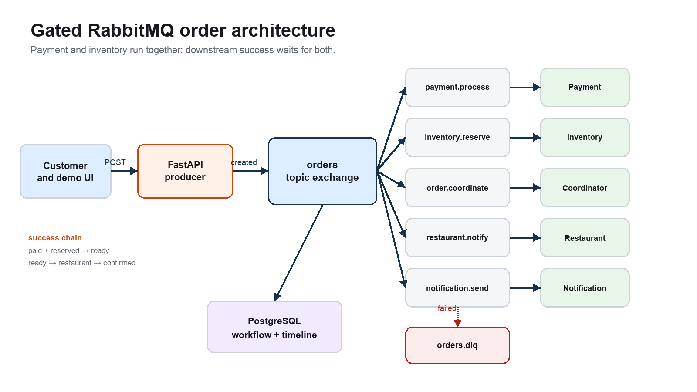
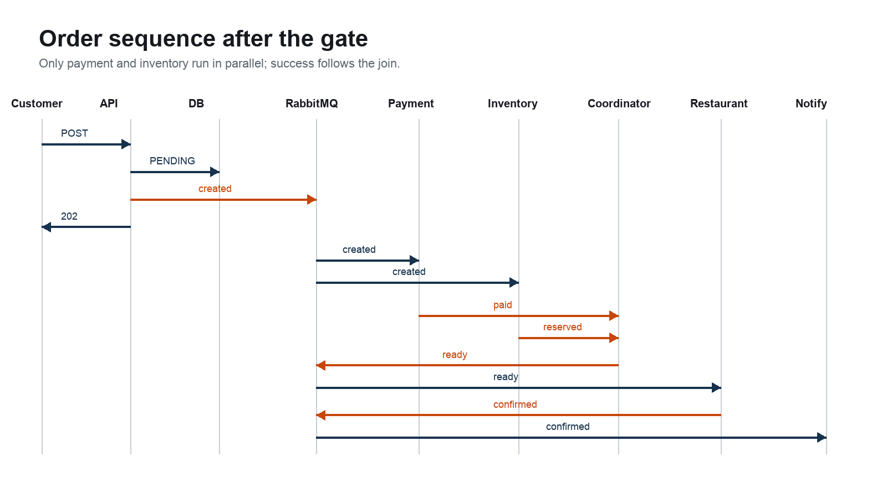
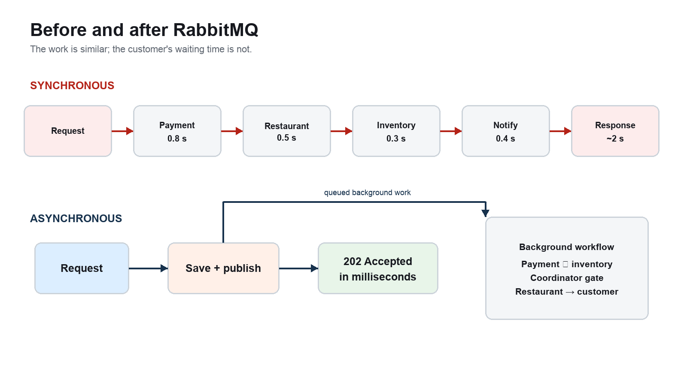
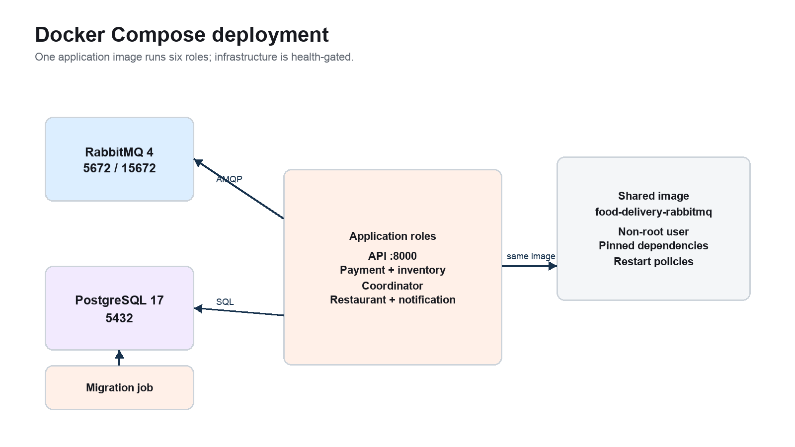

# Food Delivery Order Processing with RabbitMQ

This project compares two implementations of the same food-order workflow. The synchronous endpoint makes the customer wait while payment, inventory reservation, restaurant notification, and customer notification run in sequence. The RabbitMQ endpoint stores the order, publishes one event, and returns `202 Accepted` while coordinated workers continue in the background.

RabbitMQ does not remove the work. It removes that work from the customer's request path, absorbs bursts, and keeps jobs queued while a worker is unavailable.



## Run the complete stack

Requirements: Docker Desktop with Docker Compose v2.

```bash
cp .env.example .env
make up
make ps
make health
```

If host port 5432 is already in use, set `POSTGRES_PORT=5433` in `.env`. Container-to-container connections still use PostgreSQL's internal port 5432.

Open:

- Test and demo dashboard: <http://localhost:8000>
- API documentation: <http://localhost:8000/docs>
- RabbitMQ Management: <http://localhost:15672> (`guest` / `guest`)

Use `make reset` before a rehearsal. Use `make down` to stop the stack or `make nuke` to stop it and delete both data volumes.

## Presentation materials

- [11-slide editable presentation](artifacts/food-delivery-rabbitmq-compact-11-slides-v2.pptx)
- [Complete presenter scripts and demo runbook](artifacts/food-delivery-rabbitmq-complete-presenter-scripts.docx)

## Message flow

`POST /orders` validates and saves an order as `PENDING`, publishes `order.created` to the durable `orders` topic exchange, and returns immediately. Payment and inventory then run in parallel. A durable coordinator releases the restaurant ticket only after both have succeeded:

| Queue | Routing keys | Consumer work |
|---|---|---|
| `payment.process` | `order.created` | Simulate payment and publish `payment.succeeded` |
| `inventory.reserve` | `order.created` | Reserve inventory and publish `inventory.reserved` |
| `order.coordinate` | Success and workflow-failure results | Join prerequisites, compensate failures, and publish `order.ready` or `order.failed` |
| `restaurant.notify` | `order.ready` | Send the restaurant ticket and publish `order.confirmed` |
| `notification.send` | `order.created`, `order.confirmed`, `order.failed` | Send truthful receipt, success, or failure notifications |
| `orders.dlq` | Dead-lettered messages | Retain work that failed after the configured attempts |

The first customer message says only that the order was received. A success message and `COMPLETED` state are impossible until payment, inventory, and restaurant notification have all succeeded. Payment and inventory timeline events may appear in either order.



### RabbitMQ vocabulary in this project

- **Producer:** the FastAPI order endpoint.
- **Exchange:** `orders`, a topic exchange that routes events by subject.
- **Routing key:** an event subject such as `order.created`, `payment.succeeded`, or `order.confirmed`.
- **Queue:** a durable line of jobs owned by one service role.
- **Consumer:** a worker that handles and acknowledges a queued message.
- **Acknowledgement:** permission for RabbitMQ to remove a successfully handled delivery.
- **Binding:** the rule connecting a routing key to a queue.

## API

| Method | Path | Purpose |
|---|---|---|
| `POST` | `/orders` | Asynchronous order; returns HTTP 202 and a tracking path |
| `POST` | `/orders/sync` | Synchronous baseline; returns only after all four delays |
| `GET` | `/orders/{order_id}` | Current order state and chronological event timeline |
| `GET` | `/health` | RabbitMQ and PostgreSQL readiness |
| `GET` | `/stats` | Order counts grouped by current status |
| `GET` | `/` | Browser-based test and demo dashboard |

Example order:

```json
{
  "customer": "Aung",
  "restaurant": "Shan Noodle House",
  "items": ["Shan noodles", "Iced tea"],
  "total": 180.0
}
```

The dashboard lets you edit this payload, submit either processing path, or
launch both together for a side-by-side comparison. It reports server and
browser timing separately, follows each order's event timeline, and shows
service health and aggregate status counts. Use the refresh control if live
tracking pauses before a deliberately interrupted worker is restarted.

## Reliability behavior

- Queues and exchanges are durable; messages use persistent delivery mode.
- Publishers use confirms and mandatory routing so an unaccepted or unroutable message raises an error.
- Consumers use manual acknowledgements and `prefetch=1`.
- A failed handler republishes privately to its own queue, not through the topic exchange. This prevents a payment retry from repeating restaurant and notification work.
- Workflow outcomes and notifications have unique event keys, so at-least-once delivery does not repeat their logical side effects.
- After a critical step exhausts `MAX_RETRIES`, its message is dead-lettered and the coordinator marks the order `FAILED`, records any simulated refund or inventory release, and emits a customer failure notification.
- Notification delivery failure is recorded and dead-lettered but does not invalidate or refund an otherwise confirmed order.
- SIGTERM/SIGINT shutdown leaves unacknowledged deliveries available for redelivery.

Delivery is **at least once**. Database markers make the demo's logical outcomes idempotent; a production payment integration must also pass `order_id` as the provider's idempotency key.

## Demonstrations

### Synchronous versus RabbitMQ

```bash
make reset
make demo
```

The script sends 30 orders with six concurrent clients and reports mean, p50, p95, request wall time, and eventual completions. Record results from the presentation laptop; do not use sample values from another machine.

Measured on the development laptop on 19 September 2026:

| Metric | Synchronous | RabbitMQ |
|---|---:|---:|
| Mean API response | 2,031.4 ms | 6.0 ms |
| p50 | 2,032.1 ms | 5.5 ms |
| p95 | 2,040.8 ms | 10.0 ms |
| Request wall time for 30 orders | 10.16 s | 0.03 s |
| Orders eventually completed | 30 | 30 |

These are API acceptance times, not total background-processing times. RabbitMQ releases the caller quickly; the workers still perform the business work.



### Worker interruption and recovery

```bash
make chaos
```

The guided script asks you to stop the payment worker, submits five orders, and shows that the API continues accepting them. After the worker restarts, its durable queue drains and every order completes.

### Retry and dead-letter queue

```bash
make fail
```

This stops the normal payment worker, resets the demo, launches an always-failing payment worker, and verifies three attempts, one dead-lettered message, `FAILED` status, no restaurant ticket, a customer failure notice, and release of any inventory reservation. The Make target restarts the normal worker when the demonstration exits.

### Scale consumers

```bash
make scale
docker compose logs -f payment-worker
```

Three payment workers then share the same queue; RabbitMQ distributes deliveries between them.

## Development and tests

For host-mode development, start infrastructure with `make infra`, install the pinned requirements in a virtual environment, run `make migrate`, then use `make run` or start the API and workers separately. Copy `.env.example` to `.env` when overriding defaults.

```bash
python3 -m venv .venv
. .venv/bin/activate
pip install -r requirements.txt
make infra
make migrate
make test
```

Live integration tests require the application stack:

```bash
INTEGRATION=1 pytest -v
```

The GitHub Actions workflow runs on pushes and pull requests. It executes unit and integration tests against RabbitMQ and PostgreSQL service containers, validates the Compose file, and builds the application image.

## Presentation runbook

1. Run `make up`, wait for every long-running service to become healthy/running, then run `make test` and `make reset`.
2. Open the test dashboard, RabbitMQ Queues page, worker logs, and this README before presenting.
3. In the dashboard, choose **Compare both paths** and point out that the
   RabbitMQ result appears while the synchronous request is still waiting.
4. Compare API time with browser round-trip time in both result cards.
5. Follow the live RabbitMQ event timeline until it reaches `COMPLETED`, then
   show the payment, inventory, coordinator, restaurant, and notification logs.
6. Show the exchange, bindings, queue counts, and consumers in RabbitMQ Management.
7. Run the load comparison, followed by the worker-down demonstration if time permits.



## Troubleshooting

| Symptom | Resolution |
|---|---|
| Connection refused on 5672 or 5432 | Wait for `docker compose ps` to show healthy dependencies. |
| `PRECONDITION_FAILED` for a queue | Its immutable arguments changed; run `make nuke` in development and recreate it. |
| `orders` relation is missing | Run `make migrate` or inspect `docker compose logs migrate`. |
| Messages accumulate | Check the queue's Consumers column and the corresponding worker logs. |
| Port already in use | Stop the existing service or change the host-side port mapping. |
| Scaling reports a name conflict | Do not add `container_name` to worker services. |

## Deliberate limitations

- Payment, restaurant, inventory, and push services are simulated with delays.
- Clients poll for order status; there are no WebSockets or mobile push integrations.
- A single RabbitMQ broker is durable across restart but is not a highly available cluster.
- The implementation demonstrates at-least-once delivery with database-backed logical idempotency; real payment-provider idempotency remains outside the demo.
- Authentication, drivers, maps, dispatch, and real restaurant integrations are outside the project scope.
